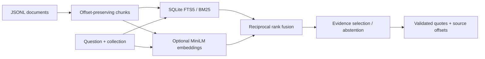

# Margin Notes

[](https://github.com/numeono/margin-notes/actions/workflows/ci.yml)

A small document retrieval service that makes every answer inspectable. Search a local
knowledge base, return an exact passage, and follow its citation back to character offsets
in the original document. Includes lexical search, optional transformer embeddings, a
local LLM evidence selector, and a FastAPI endpoint.

**Status:** personal engineering prototype, created October 2026. Demo content is entirely
synthetic. It is intended for small corpora and local experimentation.

## Try it in two minutes

Python 3.11+; no API key or model download needed for the default mode.

```sh
git clone https://github.com/numeono/margin-notes.git
cd margin-notes
python3 -m venv .venv
source .venv/bin/activate
pip install -e '.[dev]'
margin-notes ingest examples/documents.jsonl
margin-notes query 'When must travel reimbursements be submitted?'
uvicorn margin_notes.api:app --host 127.0.0.1 --port 8000
```

Open `http://127.0.0.1:8000/docs` for the interactive API, or:

```sh
curl http://127.0.0.1:8000/query -H 'Content-Type: application/json' \
  -d '{"question":"When must travel reimbursements be submitted?"}'
```

The answer is an exact source passage: “Travel reimbursements must be submitted within
30 days of the trip ending.” The response also includes the source, chunk ID, document ID,
character offsets, ranked evidence, and elapsed time. Unknown questions can return an empty
answer with `abstained: true`.

## How it works



- Ingestion hashes document content, metadata, and model identity. Unchanged documents are
  skipped; updates replace old chunks and FTS rows in one transaction.
- Word-window chunking preserves Unicode character offsets and overlap. Model/tokenizer
  truncation is still possible for unusually dense or long-token text.
- Lexical search uses FTS5 BM25. Hybrid search adds normalized transformer embeddings and
  reciprocal rank fusion (`k=60`). The embedding model and revision are pinned in code.
- Both retrieval branches apply collection filtering before ranking. Collections are an
  organizational filter, **not authentication**; the local API lets callers choose one.
- Answers are extractive. The default selector picks the sentence with the most query-term
  overlap. Optional Ollama chooses passages using structured output; every chosen quote and
  chunk ID is checked before returning it. There is no free-form answer synthesis.
- Threshold-based abstention is heuristic. A real quote can still be irrelevant or
  insufficient; exact-span validation does not establish semantic correctness.

## Semantic retrieval

```sh
pip install -e '.[dev,semantic]'
margin-notes --semantic --db data/semantic.sqlite ingest examples/documents.jsonl
margin-notes --semantic --db data/semantic.sqlite query 'How frequently are copies of the database saved?'
MARGIN_SEMANTIC=1 MARGIN_DB=data/semantic.sqlite uvicorn margin_notes.api:app
RUN_SEMANTIC=1 pytest -m semantic -q
```

Uses [all-MiniLM-L6-v2](https://huggingface.co/sentence-transformers/all-MiniLM-L6-v2)
through Sentence Transformers / PyTorch on CPU. The first run downloads the model.
Existing lexical collections must be re-ingested before hybrid queries. Dense ranking scans
the selected collection in memory; this is deliberately simple, not a billion-document index.

## Optional local LLM selection

With an existing Ollama server and a downloaded model:

```sh
MARGIN_OLLAMA_MODEL=your-installed-model uvicorn margin_notes.api:app
curl http://127.0.0.1:8000/query -H 'Content-Type: application/json' \
  -d '{"question":"When must travel reimbursements be submitted?","answerer":"ollama"}'
```

`MARGIN_OLLAMA_URL` defaults to `http://127.0.0.1:11434`. The server administrator configures
the provider; clients cannot inject a provider URL. The integration has mocked contract tests;
see `docs/VALIDATION.md` for what has actually been run. Documents are marked as untrusted in
the prompt, but this is not a claim of prompt-injection immunity.

## Testing and deployment

```sh
ruff check src tests
pytest -m 'not semantic' -q
docker build -t margin-notes .
docker run --rm -p 127.0.0.1:8000:8000 margin-notes
```

CI runs tests on Python 3.11 and 3.13 and builds/smoke-tests the non-root Docker image.
The image includes only the lexical demo, not the transformer packages or model weights.
Use `margin-notes delete ID --collection demo` to remove a document. Ingestion is a local
administrative CLI, not a public upload endpoint. HTTP responses expose server timings;
logs omit prompts and retrieved document text.

The API has no authentication, quotas, TLS termination, or durable metrics backend. Keep it
bound to loopback for demos. Before a shared deployment, add verified identity and server-side
collection authorization, size/rate limits, persistent storage, and operational monitoring.

## Evaluation

[Evidence Gate](https://github.com/numeono/evidence-gate) includes a fixture suite for this
API and measures retrieval, citation relevance, quote integrity, expected-answer coverage,
abstention, and latency. See [validation notes](docs/VALIDATION.md) for measured results and
limits. Synthetic fixture performance is not evidence of production or benchmark accuracy.

## Design references

- [SQLite FTS5 / BM25](https://www.sqlite.org/fts5.html)
- [Sentence Transformers API](https://www.sbert.net/docs/package_reference/sentence_transformer/model.html)
- [Ollama structured generation](https://docs.ollama.com/api/generate)

MIT license. Built with AI coding assistance; implementation, tests, and limitations are
available here for inspection.
